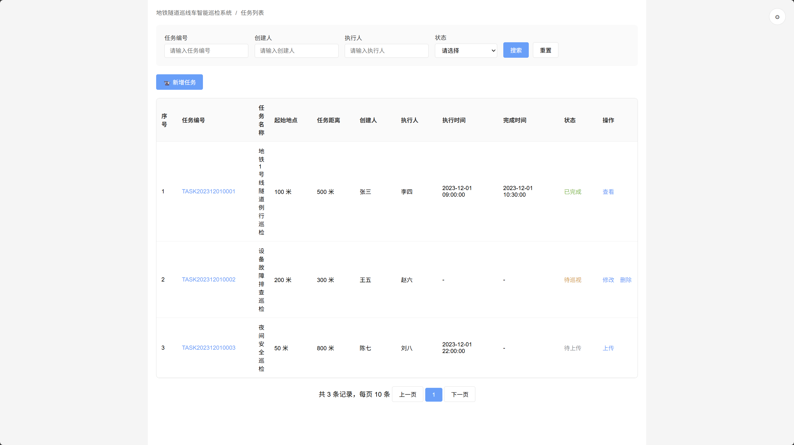
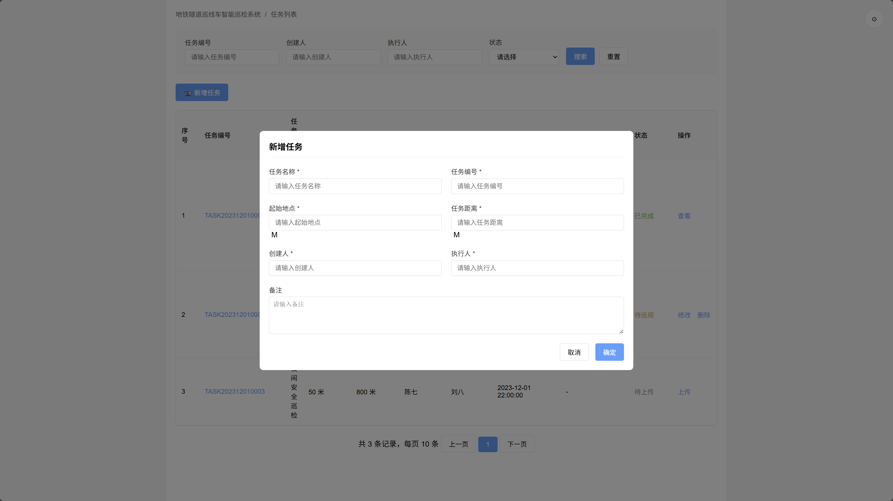

# TaskView - 任务列表页面 低保真原型

## 页面概述
任务管理主页面，提供任务的增删改查功能，支持任务搜索筛选，用户可以查看所有巡检任务的状态和详情。

## 页面结构

## 功能描述

### 搜索筛选功能
- **任务编号**: 支持模糊搜索任务编号
- **创建人/执行人**: 支持按人员筛选任务
- **状态筛选**: 下拉选择待巡视、巡视中、待上传、已完成等状态
- **搜索按钮**: 执行搜索操作
- **重置按钮**: 清空搜索条件，显示全部数据

### 任务管理功能
1. **新增任务**: 点击"📹 新增任务"按钮打开新增任务模态框
2. **任务编号链接**: 点击跳转到任务详情页面
3. **任务操作**: 根据任务状态显示不同操作按钮
   - 待巡视状态：修改、删除
   - 待上传状态：上传
   - 已完成状态：查看

### 新增任务模态框
- **基本信息**: 任务名称、任务编号、起始地点、任务距离
- **人员信息**: 创建人、执行人
- **备注信息**: 可选的任务备注说明
- **启动功能**: 创建完成后可直接启动巡检任务
- **表单验证**: 必填字段验证，数据格式检查

### 任务状态管理
- **待巡视**: 橙色标识，任务已创建等待执行
- **巡视中**: 蓝色标识，任务正在执行中
- **待上传**: 灰色标识，巡检完成等待数据上传
- **已完成**: 绿色标识，任务完全完成

## 页面流程
1. 页面加载显示任务列表
2. 用户可通过搜索表单筛选特定任务
3. 点击"新增任务"创建新的巡检任务
4. 任务创建后可选择立即启动或稍后执行
5. 通过任务编号链接查看任务详情
6. 根据任务状态执行相应操作

## 视觉设计
- 采用卡片式布局，信息层次清晰
- 搜索表单区域灰色背景，与内容区分
- 状态使用不同颜色标识，便于快速识别
- 表格采用斑马纹，提升可读性
- 模态框宽度800px，居中显示
- 响应式设计，支持不同屏幕尺寸 