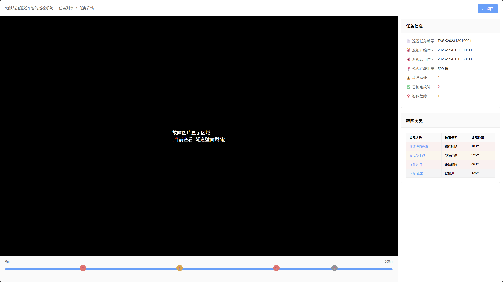

# TaskDetailView - 任务详情页面 低保真原型

## 页面概述
任务详情查看页面，展示已完成巡检任务的详细信息，包括故障图片查看、故障位置标记、故障确认功能等。

## 页面结构

## 功能描述

### 图片查看功能
- **故障图片显示**: 中央区域显示当前选中故障的高清图片
- **图片切换**: 点击进度条上的故障点标记切换查看不同故障
- **全屏预览**: 点击图片可放大查看详细信息
- **缩放操作**: 支持图片缩放、拖拽等操作

### 进度条交互
- **任务进度**: 显示巡检任务的完整路径和进度
- **故障标记**: 在对应位置显示不同类型的故障点
  - 红色📍: 已确认故障
  - 橙色📍: 疑似故障  
  - 灰色📍: 误报故障
- **位置定位**: 点击故障标记快速定位到对应图片

### 任务信息卡片
- **基本信息**: 显示任务编号、执行时间、巡检距离等
- **统计数据**: 显示故障总数、已确认数量、疑似数量
- **实时更新**: 故障确认状态变化时同步更新统计

### 故障历史列表
- **故障列表**: 以表格形式展示所有检测到的故障
- **状态标识**: 通过背景色区分不同故障状态
- **快速跳转**: 点击故障名称快速查看对应图片
- **详情查看**: 点击故障项打开详情模态框

### 故障详情模态框
- **故障图片**: 显示故障的高清图片，支持放大查看
- **故障信息**: 展示故障名称、类型、位置、描述等详细信息
- **状态确认**: 提供单选按钮确认故障是否属实
- **补充说明**: 允许用户添加额外的处理建议或说明
- **保存功能**: 确认修改后保存故障状态

## 页面流程
1. 从任务列表点击任务编号进入详情页
2. 页面加载显示任务基本信息和故障概览
3. 默认显示第一个故障的图片
4. 用户可通过进度条或故障列表切换查看不同故障
5. 点击故障项打开详情模态框进行确认操作
6. 修改故障状态后自动更新统计信息
7. 通过返回按钮回到任务列表

## 视觉设计
- 采用左右分栏布局，图片区域占主要空间
- 右侧边栏固定宽度400px，便于信息查看
- 进度条使用直观的图标标记不同故障类型
- 故障列表使用不同背景色区分状态
- 模态框宽度1150px，提供充足的图片查看空间
- 全屏布局，充分利用屏幕空间
- 面包屑导航清晰显示页面层级关系 