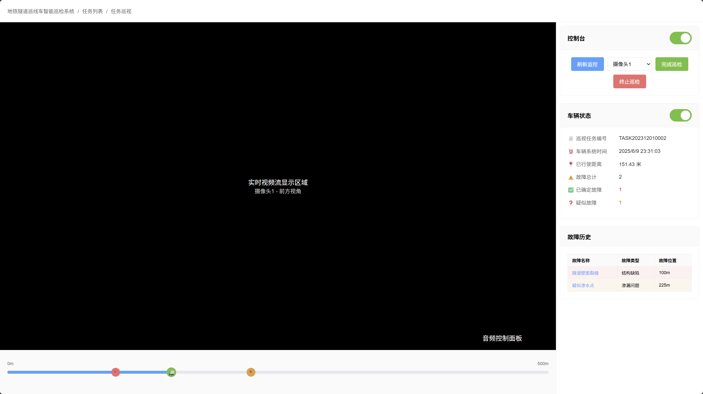

# TaskExecuteView - 任务执行页面 低保真原型

## 页面概述
任务实时执行页面，用于监控巡检车的实时状态，观看实时视频流，控制巡检过程，处理实时发现的故障。

## 页面结构

## 功能描述

### 视频监控功能
- **实时视频流**: 显示当前选中摄像头的实时画面
- **多摄像头切换**: 支持在4个摄像头视角间切换
  - 摄像头1: 前方视角
  - 摄像头2: 左侧视角  
  - 摄像头3: 右侧视角
  - 摄像头4: 后方视角
- **视频质量**: 高清实时传输，自适应网络状况
- **音频控制**: 音频控制面板，支持音量调节和静音

### 控制台功能
- **刷新监控**: 手动刷新视频流，解决连接问题
- **摄像头选择**: 下拉选择要查看的摄像头
- **完成巡检**: 正常结束当前巡检任务
- **终止巡检**: 紧急停止巡检，用于异常情况

### 车辆状态监控
- **任务信息**: 显示当前执行的任务编号
- **系统时间**: 实时显示车辆系统时间
- **行驶距离**: 动态更新已行驶的距离
- **故障统计**: 实时统计发现的故障数量
- **状态指示**: 通过颜色和动画显示车辆运行状态

### 实时进度跟踪
- **进度条**: 显示当前巡检进度和车辆位置
- **车辆标记**: 🚛图标实时显示AGV当前位置，带有脉冲动画
- **故障标记**: 实时添加新发现的故障点标记
- **位置精度**: 精确到米级的位置显示

### 实时故障处理
- **故障检测**: AI自动检测故障并实时标记
- **故障确认**: 点击故障可打开详情进行实时确认
- **故障分类**: 
  - 红色📍: 已确认故障
  - 橙色📍: 疑似故障，需要确认
- **历史记录**: 实时更新故障历史列表

### 故障详情模态框
- **实时图片**: 显示当前故障位置的实时图片
- **快速确认**: 提供快速确认故障真实性的选项
- **现场记录**: 支持添加现场观察记录
- **紧急处理**: 严重故障可标记为紧急处理

## 页面流程
1. 从任务列表启动巡检任务进入执行页面
2. 页面自动连接车辆系统和视频流
3. 显示实时视频和车辆状态信息
4. AI系统实时检测故障并在进度条上标记
5. 用户可实时确认检测到的故障
6. 车辆按设定路线行驶，实时更新位置
7. 巡检完成后点击"完成巡检"结束任务
8. 异常情况下可使用"终止巡检"紧急停止

## 视觉设计
- 全屏布局，最大化视频显示区域
- 实时数据使用动画效果，增强视觉反馈
- 车辆位置标记使用脉冲动画，突出当前位置
- 控制按钮颜色编码：绿色(完成)、红色(终止)、蓝色(刷新)
- 右侧边栏固定宽度400px，不遮挡视频内容
- 进度条高度增加，便于精确点击
- 状态信息实时更新，使用数字动画效果 