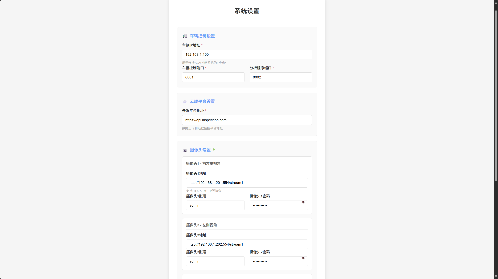
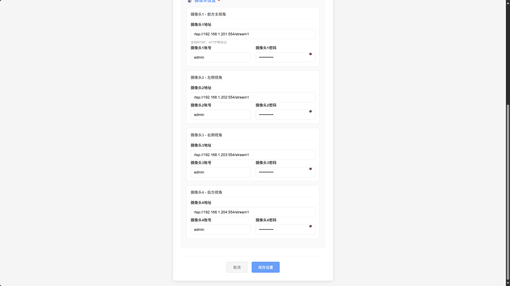

# SettingsView - 系统设置页面 低保真原型

## 页面概述
系统配置页面，用于配置巡检车连接参数、数据库设置、云端服务和摄像头参数，确保系统各组件正常工作。

## 页面结构

## 功能描述

### 数据库设置
- **数据库地址**: 配置数据库服务器IP地址
- **数据库端口**: 设置数据库连接端口，默认3306
- **数据库名称**: 指定巡检系统使用的数据库名
- **用户名/密码**: 数据库连接的认证信息
- **连接测试**: 保存时自动测试数据库连接

### 巡检车设置
- **巡检车地址**: AGV车辆控制系统的IP地址
- **行驶端口**: 车辆行驶控制通信端口
- **分析端口**: 图像分析服务通信端口
- **通信协议**: 支持TCP/IP协议通信

### 云端设置  
- **云端地址**: 云端数据上传和分析服务的API地址
- **API密钥**: 云端服务的身份验证密钥
- **数据同步**: 支持巡检数据自动上传到云端
- **服务状态**: 显示云端服务连接状态

### 摄像头设置
每个摄像头独立配置：
- **摄像头地址**: RTSP视频流地址
- **用户认证**: 摄像头登录账号和密码
- **视角说明**: 标识摄像头的安装位置和视角
- **连接状态**: 实时显示各摄像头连接状态

### 表单验证
- **IP地址验证**: 检查IP地址格式的合法性
- **端口范围验证**: 端口号必须在1-65535范围内
- **URL格式验证**: 云端地址必须是有效的HTTP/HTTPS链接
- **必填字段检查**: 标记为必填的字段不能为空
- **实时验证**: 输入时进行实时格式检查

### 密码安全
- **密码隐藏**: 密码字段默认隐藏显示
- **显示切换**: 提供眼睛图标切换密码显示/隐藏
- **安全存储**: 密码采用加密方式存储

## 页面流程
1. 页面加载时显示当前配置信息
2. 用户修改各项配置参数
3. 实时验证输入格式和有效性
4. 点击"保存设置"执行配置保存
5. 系统自动测试各项连接
6. 保存成功后提示用户重新检测系统
7. 可选择返回初始化页面重新检查连接

## 视觉设计
- 卡片式分组布局，配置项分类清晰
- 表单采用两列布局，充分利用空间
- 必填字段用红色星号(*)标识
- 输入错误时边框显示红色警告
- 保存按钮使用蓝色主色调
- 密码字段提供显示/隐藏切换
- 响应式设计，最大宽度600px居中显示
- 使用图标增强分组的视觉识别度 